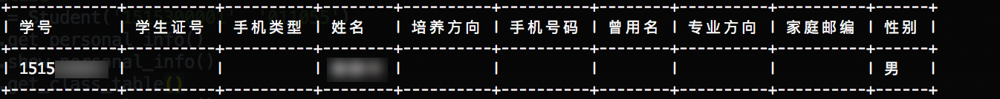
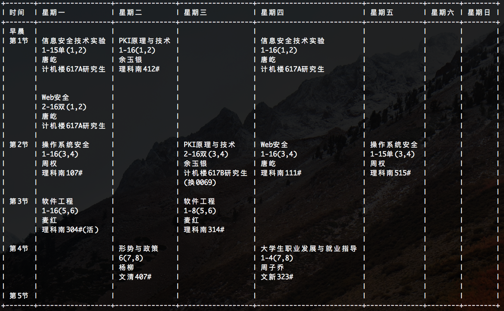
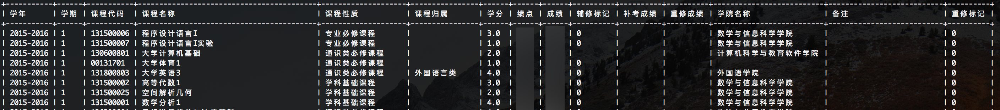
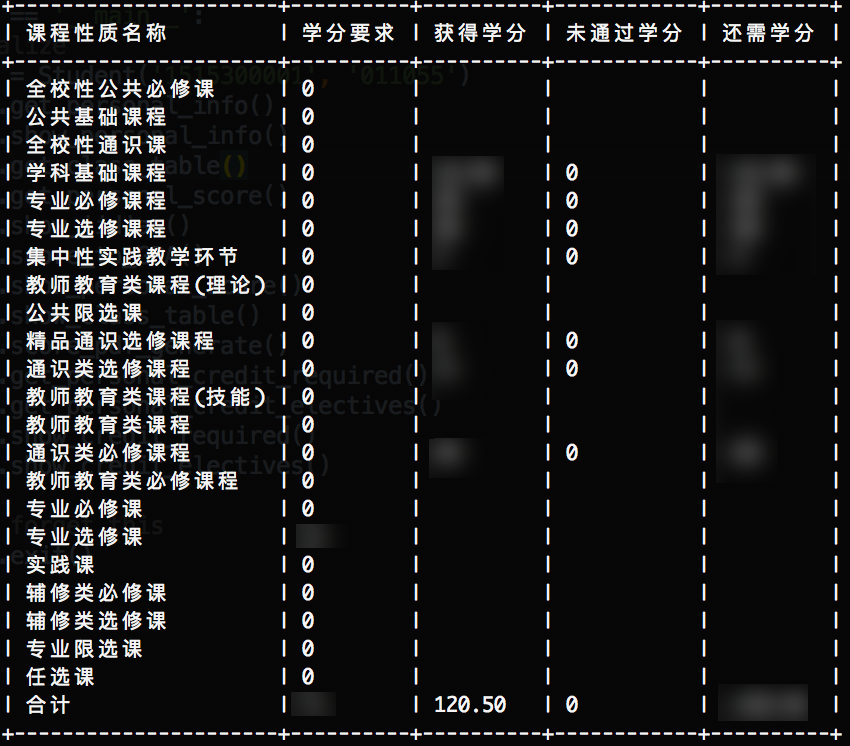
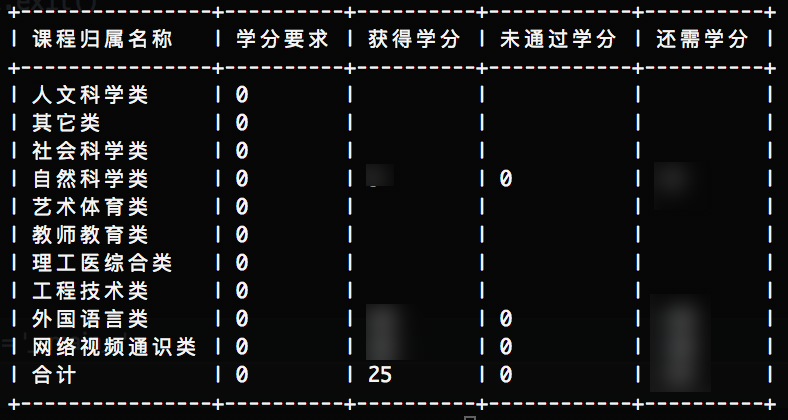
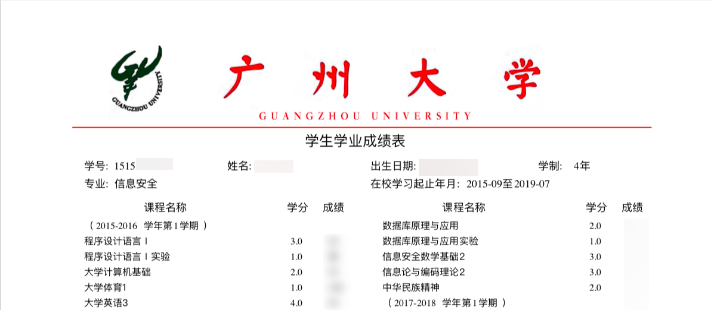

# classrate
本项目主要用于广州大学GZHU教务系统的信息抓取。（暂未适配其他学校的教务系统，如有机会会逐渐适配）可用于： 

* [x] 在预选课阶段获取全校预选课信息
* [x] 个人信息获取
* [x] 个人成绩获取
* [x] 专业课表获取
* [x] 个人信息Pretty Print
* [x] 个人成绩Pretty Print
* [x] 专业课表Pretty Print
* [x] 将5分制绩点换算为4分制GPA
* [x] 生成PDF格式的成绩单（官方样式）
* [x] 获取必修课学分
* [x] 获取选修课学分


## What you need
* 本项目在 Python 3.6 下通过测试, 其他版本未测试。

* 首先确保你以及正确配置了最新版本的*Webdriver for Chrome*，如果未安装，点[这里](https://docs.seleniumhq.org/projects/webdriver/)了解更多。 

* 并且Chrome的版本在64以上，Chrome版本太低将不支持*headless mode*。

* 然后确保你已经正确安装了如下版本的包：

    ```
    # requirements.txt:
    
    beautifulsoup4>=4.5.3
    pygal>=2.4.0
    selenium>=3.4.3
    terminaltables>=3.1.0
    reportlab>=3.4.0
    ```

在确保所需要的第三方库都顺利安装之后就可以直接使用了，推荐在终端中运行（Pretty Print支持）。

```bash
# 在终端下使用将会有更加格式化的输出
# in the terminal will have a more formatted output
from spider import Student

# 初始化
# initialize
student = Student('username', 'password')


student.get_personal_info() # 获取个人信息 Get personal information
student.show_personal_info() # 以表格方式显示个人信息 Pretty print personal information in ASCII table

student.get_class_table() # 获取专业课表 Get class table
student.show_class_table() # 以表格方式显示专业课标 Pretty print class table in ASCII table


student.get_personal_score() # 获取个人成绩 Get personal score
student.show_personal_score() # 以表格方式显示个人成绩 Pretty print personal score in ASCII table

student.show_jidian() # 获取绩点 Show 5-point GPA(jidian)
student.score_to_GPA() # 将分数转换为GPA Convert 5-point GPA(jidian) to 4-point GPA

student.score_pdf_generate() # 生成PDF格式的成绩单，输出为score_list.pdf Generate score list in PDF format and output as score_list.pdf

student.get_personal_credit_required() # 获取必修课学分 Get required classes credit
student.get_personal_credit_electives() # 获取选修课学分 Get electives classes credit
student.show_credit_required() # 以表格方式显示必修课学分 Pretty print required classes credit in ASCII table
student.show_credit_electives() # 以表格方式显示选修课学分 Pretty print electives classes credit in ASCII table

# 获取全校预选课情况，只有当预选课系统开放的时候才有用 
# Get pre-selection infos.
# Only can be used when the pre-selection system is open.
# student.get_pre_class_picked() 


# Don't forget this
student.exit()
    
```

## Output
以下输出图片中的关键信息已经遮挡。所有输出均为在terminal中的显示效果（PDF除外）。
1. 获取个人信息，在终端中运行，将会得到如下的表格，图中只截取了一部分。

    
    
2. 获取专业课表。

    
    
3. 获取个人成绩。

    
   
4. 获取必修课学分。

    

5. 获取选修课学分。

    
    
6. 输出PDF格式成绩单。(本成绩单样式与官方成绩单相同，经过精确匹配，但仅做参考使用～)

    

## License
MIT


